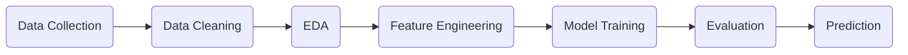

# 🏠 Delhi House Price Prediction  
### ⚡ AI-Powered Real Estate Intelligence System

<p align="center">
  
</p>

<p align="center">
  
  
  
  
</p>

---

## 🚀 Project Vision  
> Transforming raw real estate data into **smart price predictions** using Machine Learning.

In a rapidly evolving housing market like Delhi, estimating property prices manually is unreliable.  
This project builds an **intelligent prediction system** that analyzes multiple factors and predicts accurate house prices.

---

## ✨ Why This Project Stands Out  

🔹 Real-world dataset (1259+ entries)  
🔹 End-to-end ML pipeline  
🔹 Strong feature analysis & insights  
🔹 High accuracy using ensemble learning  
🔹 Clean and interpretable results  

---

## 🧠 ML Pipeline  

 


## 📊 Dataset Features  

| Feature | Description |
|--------|-------------|
| 📏 Area | Property size (sq ft) |
| 🛏️ BHK | Bedrooms |
| 🚿 Bathroom | Bathrooms |
| 🛋️ Furnishing | Furnished / Semi / Unfurnished |
| 📍 Locality | Area in Delhi |
| 🚗 Parking | Parking spaces |
| 💰 Price | Target variable |
| 🏗️ Status | Ready / Under construction |
| 🔁 Transaction | New / Resale |
| 🏢 Type | Property type |
| 📈 Per Sqft | Price per square foot |

---

## ⚙️ Models Used  

| Model | Description | Result |
|------|------------|--------|
| 🌳 Decision Tree | Baseline model | Moderate |
| 🌲 Random Forest | Ensemble learning | ⭐ Best (~84.98%) |

---

## 📈 Key Insights  

💡 Property prices are heavily influenced by:  

- Area (sq ft)  
- Number of bedrooms  
- Locality  

🏆 Premium Locations:  

- Punjabi Bagh  
- Lajpat Nagar  
- Vasant Kunj  

📊 Trend: Buyers prefer **builder floors** for flexibility & independence.

---

## 🛠️ Tech Stack  

- Python 🐍  
- Pandas 📊  
- NumPy 🔢  
- Matplotlib 📉  
- Seaborn 🎨  
- Scikit-learn 🤖  

---

## 📂 Project Structure  

```
📁 Delhi-House-Price-Prediction
│── 📓 Delhi House Price Prediction.ipynb
│── 📊 MagicBricks.csv
│── 📄 README.md
```

---

## 🚀 Getting Started  

```bash
# Clone repository
git clone https://github.com/your-username/delhi-house-price-prediction.git

# Navigate to folder
cd delhi-house-price-prediction

# Install dependencies
pip install -r requirements.txt

# Run Jupyter Notebook
jupyter notebook
```

---

## 🌟 Future Enhancements  

- 🚀 Deploy as a web app (Streamlit / Flask)  
- 📡 Integrate live real estate APIs  
- 🧠 Add advanced ML models (XGBoost, Neural Networks)  
- 📊 Interactive dashboard for visualization  

---

## 🤝 Contributing  

Contributions are welcome!  
Feel free to fork, improve, and create pull requests.

---

## 📬 Let's Connect  

If you like this project:  
⭐ Star this repo  
🔗 Share with others  
💬 Connect with me  

---

## 💡 Final Thought  

> "Data is the new real estate — and this project helps you invest wisely."

---

<p align="center"> 🚀 Built with passion for AI & Real-World Impact </p>
